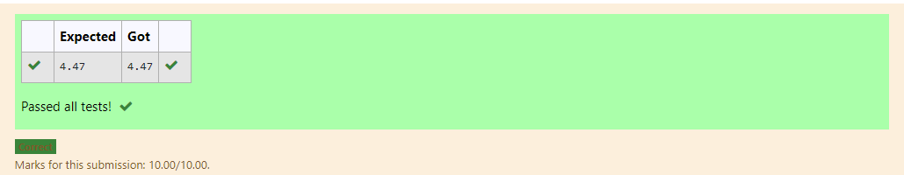

# DISTANCE-BETWEEN-TWO-POINTS

## AIM:
To write a python program to find the distance two 2 points
## ALGORITHM:
### Step 1: 
To write to find the distance between two points 
### Step 2: 
Assign the given values in a list.
### Step 3: 
Substitute the values in the distance formula  
### Step 4: 
using the distance formula to calculate the distance between two points. 
### Step 5:
End the program 
### PROGRAM:
```
  #Program to find the distance between two points.
#Developed by:B.Paarkavy
#RegisterNumber:21500424
import math
x=[10,6]
y=[4,2]
value=math.sqrt((2-4)**2+(6-10)**2)
print("{:.2f}".format(value))
```

### OUTPUT:



### RESULT:
Thus the distance between two points are successfully executed.
